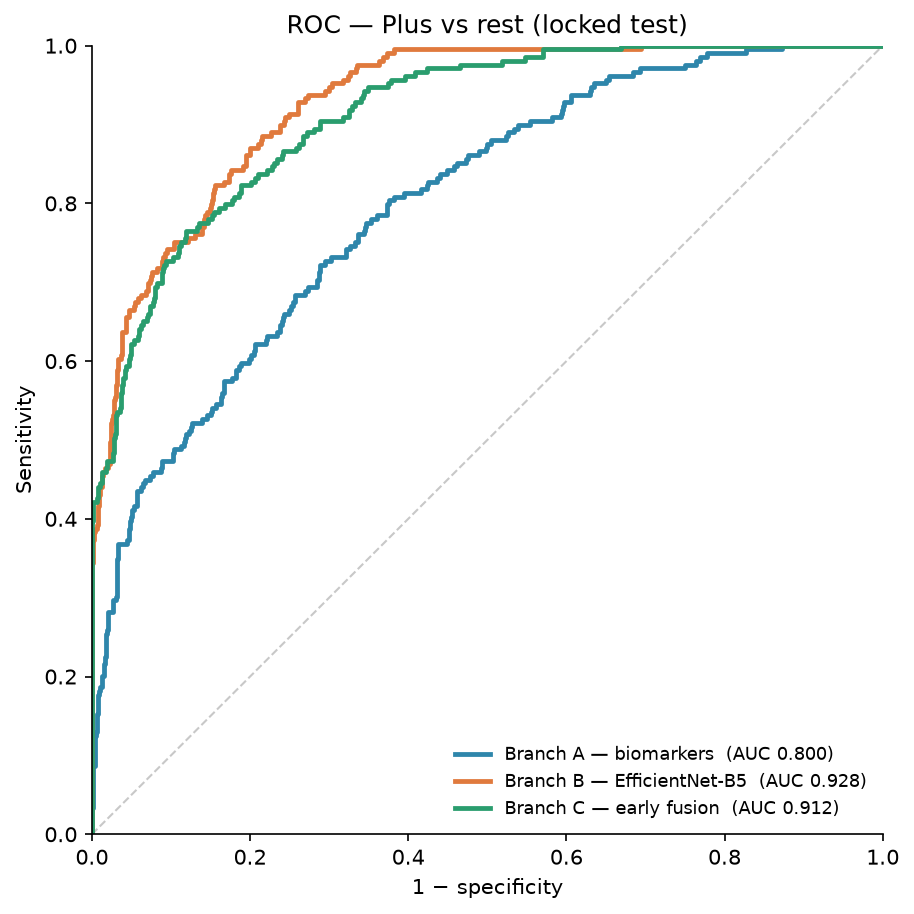
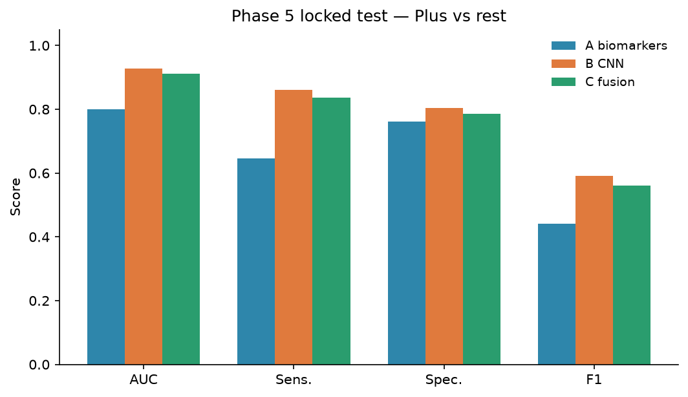
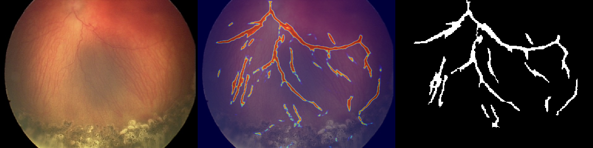
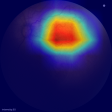
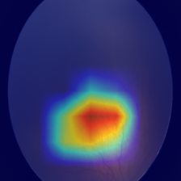
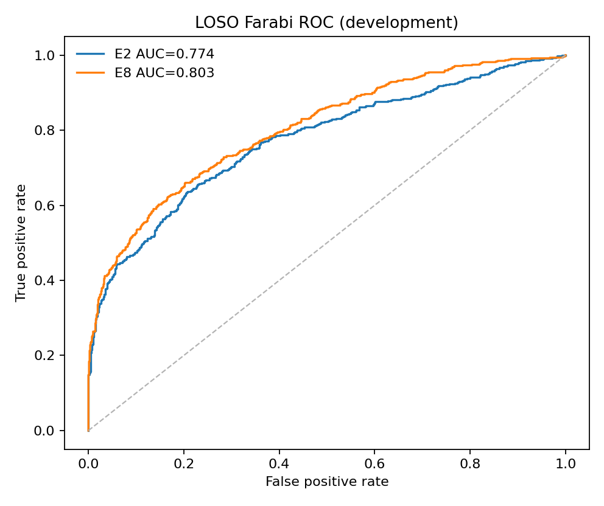

# Vascular Biomarker–Guided ROP Classification

Can **vascular biomarkers** extracted from infant fundus photos help detect **ROP Plus disease** — and does fusing them with a deep CNN beat either alone?

This project runs a fair three-way comparison on one **leakage-free** split: no patient or exam appears in more than one of train / val / test.

**Author:** Niki Mahdian · K. N. Toosi University of Technology (KNTU)

---

## Why this exists

Plus disease is judged largely from **dilation and tortuosity** of posterior-pole vessels. That clinical cue suggests two complementary signals:

1. **Explicit biomarkers** — segment vessels, measure density / tortuosity / branching / fractal features (PVBM).
2. **Learned appearance** — let a CNN read the raw fundus.

The open question is whether putting those signals together (early fusion) is better than the CNN alone. On a clean split, the honest answer here is **no** — but biomarkers still matter as an interpretable baseline, and the pipeline stays reproducible.

---

## Dataset & split

| | |
|--|--:|
| Images after exclusions | **8,870** |
| Groups (patient or exam) | **414** |
| Sources | Plus dataset · FARFUM-RoP · Farabi |
| Labels | `Normal` · `Pre_Plus` · `Plus` |
| Train / val / test | 6,211 / 1,328 / 1,331 |

Grouping: Plus & FARFUM by **patient**; Farabi by **exam** (true patient ID unavailable). Exact-hash and quality exclusions happen **before** the split. Group overlap across splits is zero.

Split fingerprint (`data/splits/all.csv` SHA-256):

```
0d4c3b3a60761ca1bda88924dbc0cbf6f1be604a6e10dd5e981e40b73f05f9c8
```

---

## Results (locked test)

Primary metric: **Plus vs rest (Plus-OvR) AUC**. Model selection and decision threshold use **validation only**; the test set is scored once.

| Branch | Approach | Test AUC | Sens. | Spec. | F1 |
|--------|----------|---------:|------:|------:|----:|
| **B** | EfficientNet-B5 on RGB fundus | **0.928** | 0.861 | 0.803 | 0.590 |
| **C** | Early fusion `[23 biomarkers ‖ 2048-d CNN emb]` → LightGBM | 0.912 | 0.837 | 0.785 | 0.560 |
| **A** | 23 PVBM biomarkers → XGBoost | 0.800 | 0.646 | 0.762 | 0.442 |

**Takeaway**

- **Branch B is the canonical winner** on this split.
- Production hybrid **C does not beat B**. An ablation in the same run shows **embedding-only (0.916) > fusion (0.912)** — concatenating raw biomarkers onto the embedding did not help.
- Branch A trails but remains the transparent, feature-level story.
- Older hybrid numbers around **~0.98** came from an **image-level leaky** split. They are invalid — do not cite them.

<p align="center">
  
</p>

<p align="center">
  
</p>

Summary CSVs: [`artifacts/`](artifacts/).

### What the model looks at

Vessel masks drive Branch A (and the biomarker half of C). Grad-CAM on Branch B usually lights up **posterior-pole vessels** — the same region clinicians weight for Plus.

<p align="center">
  
  <br>
  <em>Fundus → vessel probability → binary mask</em>
</p>

<p align="center">
  
  &nbsp;
  
  <br>
  <em>Grad-CAM examples (Plus · Pre-Plus)</em>
</p>

### Source shift (honest stress test)

A leave-one-source-out holdout of **Farabi** is the hard domain. The best development-ladder model (E2) falls to **AUC 0.774**. In-domain test scores are not the whole story.

<p align="center">
  
</p>

### External validation of the measurement layer (HVDROPDB)

The vessel mask was never scored against an expert reference, because no expert masks exist for the Farabi data. That gap is now measured externally on [HVDROPDB](https://doi.org/10.1016/j.dib.2023.109839) — 100 ROP images with manually annotated vessel masks (50 RetCam 640×480, 50 Neo 2040×2040) plus 100 expert optic-disc masks.

`scripts/hvdro_seg_validation.py` runs the deployed MAnet (same weights, `img_size` 256, threshold 0.20, same post-processing) with no retraining:

| Camera | Dice (this project) | Dice (authors' AG U-Net) | Recall | Precision |
|---|---|---|---|---|
| RetCam (n=50) | **0.754** | 0.52 | 0.814 | 0.709 |
| Neo (n=50) | **0.473** | 0.66 | 0.338 | 0.816 |

Two things follow. On the camera family the project's own data comes from, the measurement layer is *above* the published reference — so the weakness of Branch A is not a broken mask. On the second camera it collapses, with precision high (0.816) but recall low (0.338): the same camera-dependence the frozen embedding shows (source one-vs-rest AUC 0.9998) is present in the mask as well.

Raising the inference resolution does **not** fix it — Dice falls monotonically (RetCam 0.754 → 0.456 → 0.264 at 256/512/1024), because the weights were fit at 256.

The assumed optic-disc geometry (`roi: whole`, centre = image centre, radius = `min(h,w)/8`) was checked against the expert disc masks: the true disc centre sits on average **7.1–7.5 true disc radii** from the image centre and the assumed radius is **2.35–2.84×** the true one. Framing differs between datasets, so this is not an exact error for the project's data — it shows the assumption is not a general property of ROP imaging and cannot be verified without expert masks.

`scripts/hvdro_threshold.py` (threshold re-selection, no training) and `scripts/hvdro_few_shot_adaptation.py` (5-fold few-shot adaptation with early stopping and threshold chosen on an inner split) test whether the gap is cheap to close. Same images, same five folds, so the comparison is paired:

| Camera | zero-shot @ 0.20 | zero-shot @ re-selected threshold | fine-tuned (≈40 masks/fold) |
|---|---|---|---|
| RetCam (n=50) | 0.754 | 0.755 (thr 0.29) | 0.655 (**−0.099**) |
| Neo (n=50) | 0.473 | **0.579** (thr 0.005) | 0.546 (+0.074) |

**Re-selecting the decision threshold recovers more than fine-tuning does, at zero cost.** On Neo it adds **+0.106 Dice** (p<0.001, recall 0.338 → 0.566) with no weights changed; on RetCam it is a no-op (the deployed 0.20 is already near-optimal there). Fine-tuning is a strict *trade*: it gains on the camera the model is bad at and loses badly on the camera it is good at — and training on both cameras at once repeats the same pattern (Neo 0.577, RetCam 0.623). The gap is substantially a **calibration** problem, not only a representation problem.

This is why a multi-camera deployment should calibrate its decision threshold per camera, and why "just fine-tune on a few expert masks" is not the cheap fix it looks like.

Outputs land in `results/hvdro_validation/`. All of it is external validation only: no project data, no locked test, no weights are touched.

### Why the biomarker branch does not transfer

The tabular branch is at chance on an unseen acquisition source, and adding it to the image branch helps in only one of three held-out sources. The causes are measured rather than guessed. Full write-up: `docs/ACQUISITION_GEOMETRY_AND_MEASUREMENT_AUDIT.md`.

**Complete leave-one-source-out grid** (`artifacts/loo_summary_full.csv`, 9/9 rows):

| Hold-out source | n | A (biomarkers) | B (image) | C (fusion) | C − B |
|---|---|---|---|---|---|
| farabi | 1410 | **0.514** | 0.737 | 0.735 | −0.002 |
| farfum_rop | 1533 | 0.681 | 0.863 | 0.872 | +0.009 |
| plus | 6004 | 0.775 | 0.887 | 0.843 | −0.044 |

| Branch | Locked test | LOSO mean | Drop |
|---|---|---|---|
| A | 0.7999 | 0.6566 | −0.1433 |
| B | 0.9280 | 0.8290 | −0.0990 |
| C | 0.9123 | 0.8167 | −0.0956 |

Fusion beats the image branch in **one of three** held-out sources and loses on the locked test (DeLong p = 0.00806).

**The clinical feature table existed but was never read.** `src/biomarker/extract_clinical_v2.py` builds `biomarker_features_clinical_v2.csv` with vessel width in disc diameters, artery/vein-specific width and posterior-pole ring densities — the features the clinical definition of Plus actually depends on. `src/classify/branch_a_tabular.py` reads `biomarker_features.csv`, which has none of them. That table also had five concrete defects: the disc diameter was a constant (`dd_over_min_side == 0.1000` for all 8870 rows, because `PVBM.DiscSegmenter` raises and a bare `except` falls through to `min(h,w)//10`); width was sampled on every vessel pixel rather than the skeleton; there was no anatomical region; the artery/vein split was per pixel, which reported arteries *wider* than veins (`av_width_ratio_p90` 1.110); and the tortuosity chord came from `np.where` ordering, which is not a path. `scripts/clinical_features_v3.py` rebuilds the layer and corrects the artery/vein direction (1.110 → **0.934**).

**The width signal was largely an image-size proxy.** Re-normalising `width_p90_dd` by a measured disc instead of by `min(h,w)/10`, evaluated on *identical rows* so coverage is held fixed:

| Column | n | AUC (Plus vs rest) | r vs image min-side |
|---|---|---|---|
| `width_p90_dd` (constant DD) | 3772 | **0.6545** | −0.680 |
| `width_p90_dd_true` (measured DD) | 3772 | **0.5874** | −0.533 |

Dropping the width columns entirely moves source separability from 0.9986 to 0.9980, so width is not what carries the source confound — it is multivariate, with no single feature above univariate AUC 0.78.

**The label is confounded with acquisition geometry.** The dataset is five geometries, not one, and the grouped split did not balance them (`artifacts/geometry_label_balance.csv`):

| Min-side | Split | Images | Plus | Groups | Groups with Plus |
|---|---|---|---|---|---|
| 480 (640×480) | train | 1998 | **464** | 58 | **1** |
| 480 | val / test | 308 / 210 | 0 / 0 | 9 / 12 | 0 / 0 |
| 960 (1280×960) | train / val / test | 959 / 211 / 212 | 409 / 88 / 89 | 104 / 24 / 24 | 44 / 15 / 10 |
| 1080 (1440×1080) | all splits | 969 | **0** | 46 | 0 |
| 1200 (1600×1200) | train / val / test | 1098 / 229 / 230 | 191 / 41 / 41 | 56 / 10 / 10 | 12 / 2 / 2 |
| 1240 (1240×1240) | train | 1593 | **0** | 46 | **0** |
| 1240 | val / test | 458 / 395 | 78 / 79 | 9 / 6 | 1 / 1 |

Plus prevalence runs from 0 % to 42 % across geometries. All 464 Plus images at 640×480 come from a single group and lie entirely in train; train has no Plus image at 1240×1240 while 79 of the 209 test Plus images sit at that geometry. Row and column totals reconcile exactly with the locked split (6211 / 1328 / 1331), and `scripts/acquisition_geometry_audit.py` recomputes the table from the original feature table, not from any post-hoc work.

This does **not** mean the headline test AUC is inflated: within geometry branch B scores 0.875 / 0.964 / 0.951 against a pooled 0.928, so the pooled figure is not higher than the within-group figures. What it means is that the headline number mixes "detects Plus" with "transfers the Plus concept across acquisition geometries", and the two cannot be separated on this split.

### Optic-disc detector

`scripts/disc_detector_train.py` trains a U-Net (ResNet34) on the 100 HVDROPDB expert disc masks, 5-fold stratified by camera, and `scripts/disc_inference_all_images.py` applies the ensemble to every project image.

| Camera | Dice | Reference | Radius ratio | Centre error |
|---|---|---|---|---|
| RetCam (n=50) | **0.9066** | 0.93 | 0.991 | 0.060 DD |
| Neo (n=50) | **0.9203** | 0.92 | 1.024 | 0.029 DD |

That replaces the image-centre heuristic, whose radius ratio was 2.35 / 2.84 and whose centre sat 7.5 / 7.1 disc radii away. Applied zero-shot to this project's own images the detector fires confidently on only **42.5 %**; the failure is per-image, not per-patient, and overlays confirm the disc is present in some failures, so it is a domain-transfer limit rather than absent anatomy. Measured-disc features are therefore reported as missing rather than imputed for the images without a confident detection.

---

## How it works

All three branches share the same grouped CSVs and eval protocol.

```
fundus images
    │
    ├─► Branch B: EfficientNet-B5 (fine-tuned)     → P(Plus)
    │
    ├─► MAnet vessel mask → PVBM (23 features)
    │         └─► Branch A: tabular models         → P(Plus)
    │
    └─► freeze B backbone → 2048-d embedding
              concat with biomarkers → 2071-d
              └─► Branch C: LightGBM / XGBoost     → P(Plus)
```

| Piece | Detail |
|-------|--------|
| Segmentation | MAnet + ResNet34, threshold `0.20` (checkpoint filename may say DeepLabV3+ — architecture is MAnet) |
| Biomarkers | Density, geometry, fractal (23 raw features; NaNs imputed with **train** median) |
| Branch B | EfficientNet-B5, class-weighted CE, best checkpoint by val AUC |
| Branch C | Early feature fusion — not late score fusion, not joint end-to-end training |
| Eval | Plus-OvR from 3-class probabilities; Youden threshold on val; group-level bootstrap where reported |

Config hub: `configs/config.yaml` (`seed: 42`).

---

## Quick start

```bash
python -m venv .venv && source .venv/bin/activate
pip install -r requirements.txt
export PYTHONPATH=.
```

Edit paths in `configs/config.yaml`, then run in order:

```bash
python -m src.data.prepare_split
python -m src.segmentation.infer_masks
python -m src.biomarker.extract_pvbm
# extract_pvbm now writes the grouping metadata itself (group_id, patient_id, exam_id,
# identity_level). For a feature table produced before that change, re-attach it here — without
# these columns the Branch A/C evaluation silently falls back to IMAGE-level bootstrap
# uncertainty instead of group-level:
python -m src.data.refresh_feature_splits
python -m src.classify.branch_a_tabular
python -m src.classify.branch_b_cnn
python -m src.classify.branch_c_hybrid
python -m src.compare.compare
```

Optional next-architecture ladder (development / LOSO; **test stays locked**):

```bash
bash scripts/run_next_architecture_ladder.sh
```

```bash
pytest -q
```

Embedding cache identity, row order, and its one hard rule (never cross-validate over train rows):
`docs/EMBEDDING_CACHE_CONTRACT.md`.

Raw images, masks, features, full `results/`, and weights are **not** in Git — regenerate on your machine or compute host (see `.gitignore`).

---

## Repo map

| Path | What |
|------|------|
| `src/` | Split, segmentation, biomarkers, branches A/B/C, next-arch ladder |
| `scripts/` | Verify helpers and experiment runners |
| `configs/` | Central YAML |
| `data/splits/` | Official train / val / test CSVs |
| `docs/figures/` | Plots used in this README |
| `artifacts/` | Locked metric tables |
| `tests/` | Regression suites |
